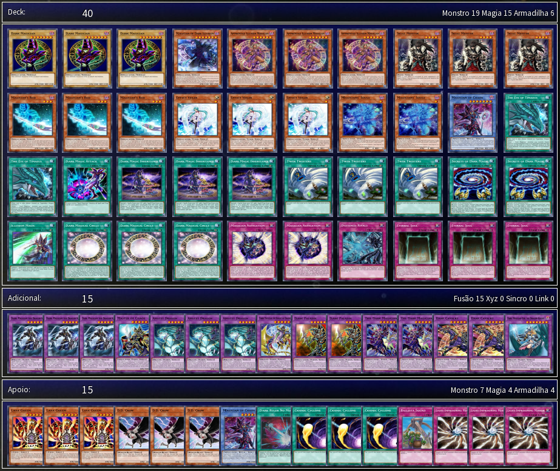

# Deck-API

O projeto **Deck-API** é uma estrutura de dados desenvolvida em **Python** para consumir informações de diferentes fontes sobre o jogo de cartas Yu-Gi-Oh TCG. Nosso objetivo é fornecer uma estrutura de fácil compreensão para desenvolvedores e usuários em geral, permitindo a criação de listas de decks completas e repletas de recursos calculados diretamente no núcleo do projeto.

# Conceitos Primitivos

Para utilizar a API de forma eficaz e aproveitá-la ao máximo, é importante entender alguns conceitos fundamentais do jogo. Esses conceitos são essenciais tanto para jogadores quanto para quem deseja contribuir com o projeto.

Abaixo, você encontrará os principais conceitos abordados:

- Deck-list
- Deck principal (main)
- Deck extra (extra)
- Deck auxiliar (side)
- Link do deck
- Arquivo do deck
- Código da carta

# Deck-list

Uma deck-list é simplesmente a lista de cartas (incluindo nome e quantidade) que compõem um baralho jogável em Yu-Gi-Oh. Independentemente do formato utilizado em campeonatos ou partidas casuais, aqui está um exemplo de deck para o formato Yu-Gi-Oh TCG Padrão:

```
Main Deck:
Snake-Eyes Flamberge Dragon x1
Snake-Eyes Diabellstar x1
Diabellstar the Black Witch x3
Fiendsmith Engraver x2
Lacrima the Crimson Tears x1
Mulcharmy Purulia x3
Ash Blossom & Joyous Spring x3
Ghost Ogre & Snow Rabbit x2
Snake-Eye Oak x1
Snake-Eye Ash x1
Snake-Eyes Poplar x1
Fabled Lurrie x1
Droll & Lock Bird x2
Effect Veiler x2
Triple Tactics Talent x1
Bonfire x3
Original Sinful Spoils - Snake-Eye x1
The Hallowed Azamina x1
Fiendsmith's Tract x1
Called by the Grave x1
WANTED: Seeker of Sinful Spoils x3
Deception of the Sinful Spoils x2
Divine Temple of the Snake-Eye x1
Infinite Impermanence x2


Extra Deck:
Fiendsmith's Desirae x1
Azamina Mu Rcielago x1
Azamina Ilia Silvia x1
Underworld Goddess of the Closed World x1
Salamangreat Raging Phoenix x1
Worldsea Dragon Zealantis x1
Promethean Princess, Bestower of Flames x1
Knightmare Phoenix x1
Hiita the Fire Charmer, Ablaze x1
S:P Little Knight x1
Fiendsmith's Sequence x1
Moon of the Closed Heaven x1
I:P Masquerena x1
Fiendsmith's Requiem x1
Relinquished Anima x1


Side Deck:
Nibiru, the Primal Being x2
Droll & Lock Bird x1
Effect Veiler x1
Harpie's Feather Duster x1
Triple Tactics Thrust x3
Dark Ruler No More x2
Cosmic Cyclone x2
Infinite Impermanence x1
Anti-Spell Fragrance x1
Skill Drain x1
```

Note que a deck-list do exemplo utiliza os componentes **"Main Deck", "Extra Deck" e "Side Deck"**.
Vale ressaltar que, no momento do lançamento deste README.md, esse deck está validado para torneios ou duelos casuais no formato convencional do Yu-Gi-Oh TCG. Nossa estrutura de dados foi projetada para fornecer recursos relacionados a esses componentes.

## Deck Principal (Main)

O Main Deck deve conter no mínimo 40 cartas e no máximo 60 cartas, conforme as regras do formato de jogo exigido. Na deck-list anterior, o deck atende a essa exigência, com 40 cartas. Em outros formatos, esses valores podem variar. Por exemplo, no formato Speed Duel, o deck principal deve ter no mínimo 20 cartas e no máximo 30.

## Deck Extra (Extra)

O Extra Deck, por outro lado, é limitado a um máximo de 15 cartas. O valor mínimo pode ser 0, permitindo que jogadores optem por não incluir nenhuma carta no Extra Deck, o que não é considerado incorreto.

## Deck Side (side)

Mais comumente utilizado em **Matches de 3**, o **Side Deck** (ou deck auxiliar) contém no máximo 15 cartas, assim como o Extra Deck. No entanto, seu objetivo é permitir a reorganização da estratégia do deck à medida que as partidas se desenvolvem, ajustando-se para enfrentar diferentes adversários.

## Link do Deck

O Link do Deck é uma URL criptografada em base64, composta por números **inteiros de 32 bits** que representam os códigos das cartas. O objetivo dessa URL é fornecer uma forma compacta de representar o deck mencionado anteriormente.
Veja abaixo um exemplo:

```
ydke://kFPjArv1nwEDwk4EA8JOBAPCTgTBMZ8DwTGfA16AtwFErQQFRK0EBUStBAWwI94AsC
PeALAj3gBS94oDUveKA/7FuAIynZMA/PhgBSoL0gX9iZwF/YmcBbIyzAWyMswFHjeCAV2fEgV
dnxIFXZ8SBf5jTgWUOqcFRQTgBT6kcQHqmNEE6pjRBOqY0QRIF/QDSBf0A896MgMiSJkAIkiZ
AA==!+0rlBFrfXwQ688MCuk7ZBQDOZwMVXbACcU0qAKSaKwCw3ugCyhq/AXvs+AK33kcE2iPr
AzKYJQCxSZ4F!1xqfAdcanwH9iZwFsjLMBfvcFAEQLRoCEC0aAhAtGgImkEIDJpBCA4QlfgCE
JX4AIkiZAFEQgwOhZu4E!
```



Este link YDKE foi extraído do ProjetoIgnis (EdoPro). Em outros softwares, também é possível obter **links semelhantes**, que podem ser facilmente lidos e processados. Este projeto se baseia nesse link e no arquivo do deck para realizar suas funções.

## Arquivo do Deck

O arquivo de uma deck list em Yu-Gi-Oh possui o sequinte formato interno:

```
#created by Player
#main
48452496
27260347
72270339
72270339
72270339
60764609
60764609
28803166
84192580
84192580
84192580
14558128
14558128
14558128
59438930
59438930
45663742
9674034
90241276
97651498
94145021
94145021
97268402
97268402
25311006
85106525
85106525
85106525
89023486
94845588
98567237
24224830
80845034
80845034
80845034
66328392
66328392
53639887
10045474
10045474
#extra
82135803
73391962
46396218
98127546
57134592
45112597
2772337
2857636
48815792
29301450
49867899
71818935
65741786
2463794
94259633
!side
27204311
27204311
94145021
97268402
18144507
35269904
35269904
35269904
54693926
54693926
8267140
8267140
10045474
58921041
82732705
```

Essa é a deck list de código do exemplo anterior, perceba que o padrão mínimo é
esse:

```
#created by Player
#main
#extra
!side
```

O formato do arquivo é **YDK**, e todos os códigos mencionados acima são os valores de 32 bits descriptografados para cada carta. As cartas que se repetem têm múltiplos códigos, com um limite máximo de 3 cartas por nome/código.

## Código da Carta

Cada carta possui um código único de 32 bits. Isso significa que nenhum código pode ser repetido. Mesmo cartas com o mesmo nome, como versões alternativas, possuem códigos diferentes, geralmente variando em +1 ou -1 em relação ao código da versão original. O código da carta é uma ferramenta útil para garantir precisão, tanto em buscas binárias quanto na unificação das cartas.

# Informações Adicionais

Se você deseja contribuir com o projeto, entre em contato através do e-mail yugiohsuport@gmail.com para obter mais detalhes. Também é possível abrir uma issue para relatar dúvidas, problemas ou bugs encontrados.

# Como Contribuir

Contribuir para este projeto é simples e muito bem-vindo! Aqui estão algumas maneiras pelas quais você pode ajudar:

- Relatar Bugs:
> Se você encontrar um bug ou comportamento inesperado, abra uma issue detalhando o problema para que possamos corrigir.
- Sugerir Novos Recursos:
> Se você tem ideias para novos recursos ou melhorias, sinta-se à vontade para sugerir uma issue. Adoramos ouvir sugestões de usuários!

Contribuições de Código: Se você deseja contribuir com código, siga estas etapas:

- Faça um fork deste repositório.
- Realize suas modificações e teste-as.
- Envie um pull request com uma descrição clara das alterações realizadas.

## Documentação

> Se você identificar algo que possa ser melhorado na documentação, seja código ou texto explicativo, sinta-se à vontade para enviar uma contribuição.
> Feedback e Melhoria Contínua: Compartilhe seu feedback sobre o uso da API, sugestões de melhorias ou qualquer outra ideia que possa aprimorar o projeto.

# Licença

Este projeto está licenciado sob a MIT License. Isso significa que você pode usar, modificar e distribuir o código livremente, desde que inclua a mesma licença em qualquer trabalho derivado.

# Código de Conduta

Para garantir um ambiente colaborativo e respeitoso, pedimos que todos os colaboradores sigam as diretrizes do código de conduta. Seja sempre respeitoso, educado e compreensivo com todos os participantes.

# Agradecimentos

Agradecemos a todos que ajudaram a construir e melhorar este projeto, seja por contribuições de código, relatórios de bugs ou sugestões de melhorias.